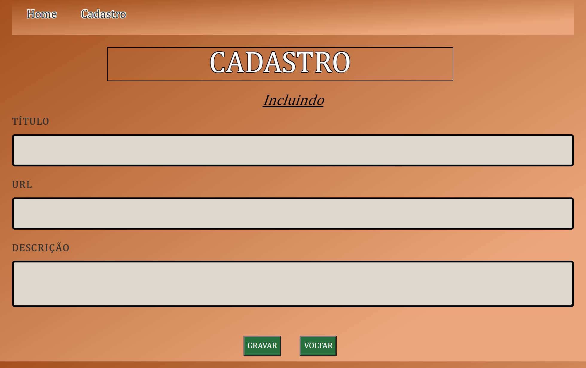

# Alurapic

Veja o projeto aqui: https://amandasoaress.github.io/alurapic/

Este foi meu primeiro projeto 100% em vuejs, criei do zero com o vue-cli.

O projeto permite a inclusão de imagens, assim como a edição e exclusão. Além disso, é possível ver a lista de imagens e filtrar pelo título.

Inicialmente foi utilizada uma API com Node para servir os recursos necessários, utilizei a API em todo processo de desenvolvimento e, para finalizar, adicionei a possibilidade de realizar as mesmas operações utilizando o localstorage ao invés da API, assim foi possível realizar o upload do projeto para o github pages sem a necessidade de um backend, fornecendo uma amostra da experiência para todos de forma gratuita.

Neste projeto aprendi a criar aplicações com VueJs na versão 2, utilizando vue-router para as rotas, vue-validate para a validação do formulário de cadastro e o bootstrap para agilizar o processo de estilização.

## Como rodar no localhost

###  Clonar o repositório

```sh
git clone git@github.com:AmandaSoaress/fokus.git
```

Por ser tratar do framework Vue, é necessário a instalação de todas as dependências que o projeto funcione corretamente. Para isso, é necessário ter o `node` e  o `npm` instalados na maquina.

Eu utilizei o `node` na versão `v12.22.12` e o `npm` na versão `6.14.16`.

###  Instalar dependências

Abra a pasta do projeto e execute o `npm install`:

```sh
cd fokus
npm install
```

### Iniciar o projeto

Após a instalação dos pacotes, basta iniciar o projeto:

```sh
npm run dev
```

Pronto, você já está rodando o projeto em seu computador.

## Build para Deploy

Para fazer a build e obter os arquivos estáticos, você pode executar:

```sh
npm run build
```


<br>
<br>



